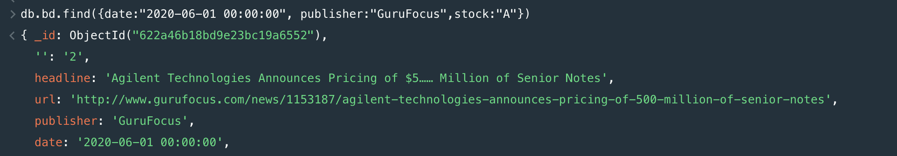
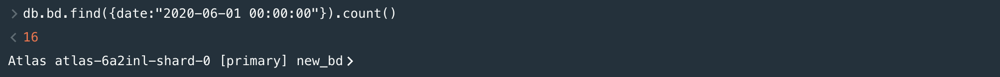
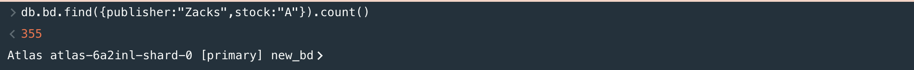

# mongodb

## Установка, заполнение данными

Устанавливаем MongoDB Compass с официального [сайта](https://www.mongodb.com/try/download/community) . Далее для удобства я создал бесплатный кластер также на [сайте](https://www.mongodb.com/basics/clusters), к которому подключаемся через ранее устанвленный клиент. Создаем новую базу данных. Я выбрал Daily Financial News for 6000+ Stocks из [source](https://www.kaggle.com/miguelaenlle/massive-stock-news-analysis-db-for-nlpbacktests)


После того как данные загружены напишем несколько запросов на выборку и изменение данных.

## Запросы

Запросы на выборку:
1) Какие новости публиковало издание GuruFocus 1-го июня по акциям класса А?
```javascript
db.bd.find({date:"2020-06-01 00:00:00", publisher:"GuruFocus",stock:"A"})
```


2) Сколько всего новостей было опубликовано 1-го июня?
```javascript
db.bd.find({date:"2020-06-01 00:00:00"}).count()
```


3) Сколько всего было новостей про акции класса А за период с 2009 по 2020 год у издания Zacks?
```javascript
db.bd.find({publisher:"Zacks",stock:"A"}).count()
```

